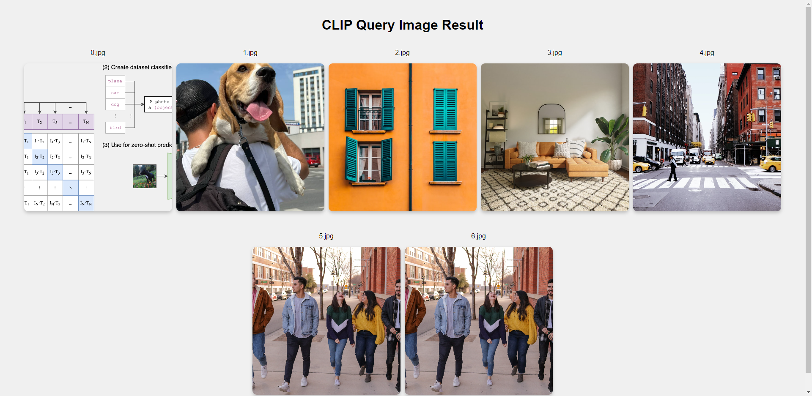

English| [简体中文](./README_cn.md)

Getting Started with Clip
=======


# Feature Introduction

CLIP (https://github.com/openai/CLIP/) is a multimodal machine learning model proposed by OpenAI. This model uses contrastive learning on large-scale image-text pairs to process both images and text, mapping them into a shared vector space.

- [clip_encode_image](./clip_encode_image): an dnn node for the CLIP image encoder, currently supporting two modes:
  - Local mode: Supports input backpropagation, outputting text encoding features.
  - Service mode: Based on ROS Action Server, supports client nodes sending inference requests and calculating the returned text encoding features.

- [clip_encode_text](./clip_encode_text): an dnn node for the CLIP text encoder, currently supporting two modes:
  - Local mode: Supports input backpropagation, outputting text encoding features.
  - Service mode: Based on ROS Action Server, supports client nodes sending inference requests and calculating the returned text encoding features.

- [clip_manage](./clip_manage): CLIP relay node responsible for clienting and servicing. Currently, it supports two modes:
  - Storage mode: Send encoding requests to the image encoding node clip_encode_image, retrieve image encoding features from the target folder, and store the image encoding features in the local SQLite database.
  - Query mode: Send an encoding request to the text encoding node clip_encode_text to obtain the encoding features of the target text. Next step, match the text features with image features in the database to obtain the matching results.

- [clip_msgs](./clip_msgs): CLIP app topic definition, action server control msg definition。


## How to use

### Get model
Run command:
```shell
cp -r ./install/clip_encode_image/config .
wget http://archive.d-robotics.cc/models/clip_encode_text/text_encoder.tar.gz
sudo tar -xf text_encoder.tar.gz -C config
```

### Mode One: Storage

Run command:
```shell
source /opt/ros/humble/setup.bash
source ./install/setup.bash
ros2 launch clip_manage hobot_clip_manage.launch.py clip_mode:=0
```

log:
```shell
[INFO] [launch]: All log files can be found below .ros/log/1970-01-06-00-39-32-295992-buildroot-6705
[INFO] [launch]: Default logging verbosity is set to INFO
cp_cmd is  cp -r /userdata/install/lib/clip_manage/config/index.html .
[INFO] [clip_encode_image-1]: process started with pid [6727]
[INFO] [clip_encode_text_node-2]: process started with pid [6729]
[INFO] [clip_manage-3]: process started with pid [6731]
[clip_manage-3] [WARN] [0000434373.495141916] [ClipNode]: This is hobot recorder node!
[clip_manage-3] [WARN] [0000434373.536474791] [ClipNode]: Parameter:
[clip_manage-3]  mode(0:storage, 1:query): 0
[clip_manage-3]  db file: clip.db
[clip_manage-3]  storage folder: /userdata/config
[clip_manage-3]  text: a diagram
[clip_manage-3]  result folder: /userdata/result
[clip_manage-3]  topk: 10
[clip_encode_image-1] [WARN] [0000434373.567931791] [ClipImageNode]: Parameter:
[clip_encode_image-1]  feed_type(0:loacl, 1:sub): 1
[clip_encode_image-1]  is_shared_mem_sub: 1
[clip_encode_image-1]  is_sync_mode_: 1
[clip_encode_image-1]  image: config/CLIP.png
[clip_encode_image-1]  model_file_name_: config/full_model_11.bin
[clip_encode_image-1] [BPU_PLAT]BPU Platform Version(1.3.6)!
[clip_encode_image-1] [HBRT] set log level as 0. version = 3.15.49.0
[clip_encode_image-1] [DNN] Runtime version = 1.23.8_(3.15.49 HBRT)
[clip_manage-3] [WARN] [0000434374.492834334] [image_action_client]: Action client recved goal
[clip_manage-3] [WARN] [0000434374.493161250] [image_action_client]: Action client got lock
[clip_manage-3] [WARN] [0000434374.493402834] [image_action_client]: Sending goal, type: 1, urls size: 0
[clip_encode_image-1] [WARN] [0000434374.494557250] [encode_image_server]: Received goal request with type: 1
[clip_encode_image-1] [WARN] [0000434374.495408375] [encode_image_server]: Executing goal
[clip_encode_image-1] [A][DNN][packed_model.cpp:247][Model](1970-01-06,00:39:35.348.968) [HorizonRT] The model builder version = 1.23.5
[clip_encode_image-1] [WARN] [0000434376.125547543] [ClipImageNode]: Create hbmem_subscription with topic_name: /hbmem_img
[clip_encode_text_node-2] [WARN] [0000434377.487820335] [clip_encode_text_node]: Clip Encode Text Node has been started.
[clip_encode_image-1] [W][DNN]bpu_model_info.cpp:491][Version](1970-01-06,00:39:36.17.778) Model: full_model_11. Inconsistency between the hbrt library version 3.15.49.0 and the model build version 3.15.47.0 detected, in order to ensure correct model results, it is recommended to use compilation tools and the BPU SDK from the same OpenExplorer package.
[clip_encode_image-1] [WARN] [0000434379.674204836] [ClipImageNode]: Sub img fps: 1.58, Smart fps: 1.58, preprocess time ms: 1422, infer time ms: 218, post process time ms: 0
[clip_encode_image-1] [WARN] [0000434380.881684628] [ClipImageNode]: Sub img fps: 3.31, Smart fps: 3.31, preprocess time ms: 44, infer time ms: 216, post process time ms: 0
[clip_encode_image-1] [WARN] [0000434380.882277045] [encode_image_server]: Goal complete, task_result: 1
[clip_manage-3] [WARN] [0000434381.704573129] [image_action_client]: Get Result errorcode: 0
[clip_manage-3] [WARN] [0000434381.704934504] [ClipNode]: Storage finish, current num of database: 7.

```
### Mode Two: Query

Run command:
```shell
source /opt/ros/humble/setup.bash
source ./install/setup.bash
ros2 launch clip_manage hobot_clip_manage.launch.py clip_mode:=1
```


log:
```shell
[INFO] [launch]: All log files can be found below .ros/log/1970-01-06-00-52-22-194820-buildroot-11657
[INFO] [launch]: Default logging verbosity is set to INFO
cp_cmd is  cp -r /userdata/install/lib/clip_manage/config/index.html .
[INFO] [clip_encode_image-1]: process started with pid [11665]
[INFO] [clip_encode_text_node-2]: process started with pid [11667]
[INFO] [clip_manage-3]: process started with pid [11669]
[clip_manage-3] [WARN] [0000435142.681299492] [ClipNode]: This is hobot recorder node!
[clip_encode_image-1] [WARN] [0000435142.716965242] [ClipImageNode]: Parameter:
[clip_encode_image-1]  feed_type(0:loacl, 1:sub): 1
[clip_encode_image-1]  is_shared_mem_sub: 1
[clip_encode_image-1]  is_sync_mode_: 1
[clip_encode_image-1]  image: config/CLIP.png
[clip_encode_image-1]  model_file_name_: config/full_model_11.bin
[clip_manage-3] [WARN] [0000435142.728286283] [ClipNode]: Parameter:
[clip_manage-3]  mode(0:storage, 1:query): 1
[clip_manage-3]  db file: clip.db
[clip_manage-3]  storage folder: /userdata/config
[clip_manage-3]  text: a diagram
[clip_manage-3]  result folder: result
[clip_manage-3]  topk: 10
[clip_encode_image-1] [BPU_PLAT]BPU Platform Version(1.3.6)!
[clip_encode_image-1] [HBRT] set log level as 0. version = 3.15.49.0
[clip_encode_image-1] [DNN] Runtime version = 1.23.8_(3.15.49 HBRT)
[clip_manage-3] [WARN] [0000435142.787764867] [text_action_client]: Action client recved goal
[clip_manage-3] [WARN] [0000435142.788127200] [text_action_client]: Action client got lock
[clip_encode_image-1] [A][DNN][packed_model.cpp:247][Model](1970-01-06,00:52:24.490.681) [HorizonRT] The model builder version = 1.23.5
[clip_encode_image-1] [WARN] [0000435145.258931784] [ClipImageNode]: Create hbmem_subscription with topic_name: /hbmem_img
[clip_encode_text_node-2] [WARN] [0000435146.162105327] [clip_encode_text_node]: Clip Encode Text Node has been started.
[clip_manage-3] [WARN] [0000435148.281324286] [text_action_client]: Sending goal, type: 0, texts: a diagram
[clip_encode_text_node-2] [WARN] [0000435148.297706328] [clip_encode_text_node]: Request texts: ['a diagram']
[clip_manage-3] [WARN] [0000435148.509009119] [ClipNode]: Query start, num of database: 7.
[clip_manage-3] [WARN] [0000435148.509820786] [ClipNode]: Query finished! Cost 1 ms.
[clip_encode_text_node-2] [WARN] [0000435148.514026703] [clip_encode_text_node]: Clip Encode Text Node work success.
[clip_manage-3] [WARN] [0000435148.532558536] [ClipNode]: Query Result /userdata/config/CLIP.png, similarity: 0.289350
[clip_manage-3] [WARN] [0000435148.540040328] [ClipNode]: Query Result /userdata/config/dog.jpg, similarity: 0.228837
[clip_manage-3] [WARN] [0000435148.547667078] [ClipNode]: Query Result /userdata/config/target_class.jpg, similarity: 0.224744
[clip_manage-3] [WARN] [0000435148.555092286] [ClipNode]: Query Result /userdata/config/target.jpg, similarity: 0.207572
[clip_manage-3] [WARN] [0000435148.562450494] [ClipNode]: Query Result /userdata/config/raw_unet.jpg, similarity: 0.198459
[clip_manage-3] [WARN] [0000435148.569500536] [ClipNode]: Query Result /userdata/config/people.jpg, similarity: 0.174074
[clip_manage-3] [WARN] [0000435148.576885453] [ClipNode]: Query Result /userdata/config/test.jpg, similarity: 0.174074
[clip_manage-3] [WARN] [0000435148.584450703] [text_action_client]: Get Result errorcode: 0
```

## Web demonstration

```shell
# Open terminal：

# Start the web service to view the query results, and make sure that /userdata is the upper level directory of the query result.
cp -r install/lib/clip_manage/config/index.html /userdata
cd /userdata
python -m http.server
```

Using Google Chrome or Edge, enter< http://IP:8000 >, you can view the image retrieval results (IP is the device IP address).



Result analysis: The similarity between the retrieved text and images can be seen in order of retrieval results.