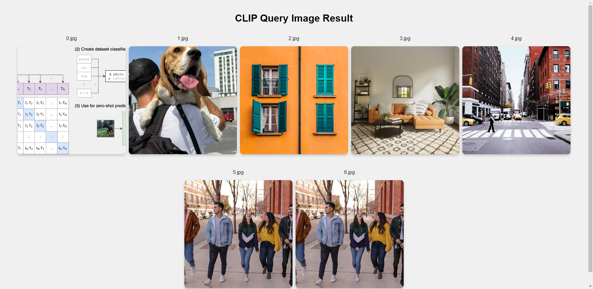

[English](./README.md) | 简体中文

# 功能介绍

CLIP（https://github.com/openai/CLIP/）是由OpenAI提出的一种多模态机器学习模型。该模型通过对大规模图像和文本对进行对比学习，能够同时处理图像和文本，并将它们映射到一个共享的向量空间中。

本项目是 CLIP 中继节点,负责收发 目前支持两种模式：
1. 入库模式：向图像编码节点 clip_encode_image 发送编码请求, 获取目标文件夹中图像编码特征, 将图像编码特征存储到本地SQLite数据库中。
2. 查询模式：向文本编码节点 clip_encode_text 发送编码请求, 获取目标文本编码特征。进一步将文本特征与数据库图像特征进行匹配, 获得匹配结果。

算法输出的数据结构ClipItem：
```c++
struct ClipItem {
  bool type;        // item 类型, true: 图片, false: 文本
  std::string name; // item 名
  std::string text; // item text, 仅item为文本时有效
  std::string url;  // item 文件路径地址, 仅item为图片时有效
  std::vector<float> feature; // item 对应的特征, 长度512
  std::vector<std::string> extra;   // item 额外信息, 如对应深度图路径、IMU数据路径、其他说明等。

  int id;           // item 唯一id
  long timestamp;   // item 入库时间戳
  float similarity; // item 的相似度
};
```

# 开发环境

- 编程语言: C/C++
- 开发平台: X5
- 系统版本：Ubuntu 22.04
- 编译工具链:Linux GCC 11.4.0

# 编译

- X5版本：支持在X5 Ubuntu系统上编译和在PC上使用docker交叉编译两种方式。

## 依赖库

ros package：

- clip_msgs

## X5 Ubuntu系统上编译

1、编译环境确认

- 板端已安装X5 Ubuntu系统。
- 当前编译终端已设置TogetherROS环境变量：`source PATH/setup.bash`。其中PATH为TogetherROS的安装路径。
- 已安装ROS2编译工具colcon。安装的ROS不包含编译工具colcon，需要手动安装colcon。colcon安装命令：`pip install -U colcon-common-extensions`

2、编译

- 编译命令：`colcon build --packages-select clip_manage`

## docker交叉编译 X5 版本

1、编译环境确认

- 在docker中编译，并且docker中已经安装好TogetherROS。docker安装、交叉编译说明、TogetherROS编译和部署说明详见机器人开发平台robot_dev_config repo中的README.md。

2、编译

- 编译命令：

  ```shell
  # RDK X5
  bash robot_dev_config/build.sh -p X5 -s clip_manage
  ```

## 注意事项

# 使用介绍

## 参数

| 参数名             | 解释                                  | 是否必须             | 默认值              | 备注                                                                    |
| ------------------ | ------------------------------------- | -------------------- | ------------------- | ----------------------------------------------------------------------- |
| mode          | 模式，0：入库；1：检索            | 否                   | 0                   |
| text              | 查询文本                          | 否                   | "a diagram"     |
| db_file              | db文件名字                          | 否                   | clip.db     |
| storage_folder  | 待入库的图片文件存储绝对路径        | 否                   | /userdata/config                   | 
| result_folder  | 检索结果存放绝对路径        | 否                   | /userdata/result                   | 
| topk  | 检索结果数TopK        | 否                   | 10                   | 


## 运行

- 运行模式 1 前, 请先启动[clip_encode_image](./../clip_encode_image/README.md)

- 运行模式 2 前, 请先启动[clip_encode_text](./../clip_encode_text/README.md)

## X5 Ubuntu系统上运行

运行方式1，使用可执行文件启动：

```shell
export COLCON_CURRENT_PREFIX=./install
source /opt/ros/humble/setup.bash
source ./install/local_setup.bash

# 运行模式1：入库, 使用本地图片进行入库操作(需要先开启clip_encode_image的示例) 
# - 终端1：启动 clip_encode_image节点服务模式
cp -r ./install/lib/clip_encode_image/config .
ros2 run clip_encode_image clip_encode_image --ros-args -p feed_type:=1 --log-level warn -p is_sync_mode:=1

# - 终端2：发送 image 图片编码请求
ros2 run clip_manage clip_manage --ros-args -p mode:=0 -p db_file:=clip.db -p storage_folder:=/userdata/config


# 运行模式2：查询, 输入检索文本, 查询数据库中的图片(需要先开启clip_encode_text的示例)
# - 终端1：启动 clip_encode_text 服务模式
wget http://sunrise.horizon.cc/models/clip_encode_text/text_encoder.tar.gz
sudo tar -xf text_encoder.tar.gz -C config
ros2 run clip_encode_text clip_encode_text_node --ros-args -p feed_type:=true --log-level info

# - 终端2：发送 text 文本编码请求, 并根据文本特征, 查询数据库图片相似度。
ros2 run clip_manage clip_manage --ros-args -p mode:=1 --log-level info -p db_file:=clip.db -p result_folder:=/userdata/result -p text:="a diagram"
```

运行方式2，使用launch文件启动：
```shell
export COLCON_CURRENT_PREFIX=./install
source /opt/ros/humble/setup.bash
source ./install/setup.bash

# 运行模式1：入库, 使用本地图片进行入库操作
ros2 launch clip_manage hobot_clip_manage.launch.py clip_mode:=0

# 运行模式2：查询, 输入检索文本, 查询数据库中的图片
ros2 launch clip_manage hobot_clip_manage.launch.py clip_mode:=1
```

## X5 buildroot系统上运行

```shell
export ROS_LOG_DIR=/userdata/
export LD_LIBRARY_PATH=${LD_LIBRARY_PATH}:./install/lib/

# 运行模式1：入库, 使用本地图片进行入库操作(需要先开启clip_encode_image的示例) 
# - 终端1：启动 clip_encode_image节点服务模式
cp -r ./install/lib/clip_encode_image/config .
./install/lib/clip_encode_image/clip_encode_image --ros-args -p feed_type:=1 --log-level warn -p is_sync_mode:=1

# - 终端2：发送 image 图片编码请求
./install/lib/clip_manage/clip_manage --ros-args -p mode:=0 -p db_file:=clip.db -p storage_folder:=/userdata/config


# 运行模式2：查询, 输入检索文本, 查询数据库中的图片(需要先开启clip_encode_text的示例)

# - 终端1：启动 clip_encode_text 服务模式
wget http://sunrise.horizon.cc/models/clip_encode_text/text_encoder.tar.gz
sudo tar -xf text_encoder.tar.gz -C config
./install/lib/clip_encode_text/clip_encode_text_node --ros-args -p feed_type:=true --log-level info

# - 终端2：发送 text 文本编码请求, 并根据文本特征, 查询数据库图片相似度。
./install/lib/clip_manage/clip_manage --ros-args -p mode:=1 --log-level info -p db_file:=clip.db -p result_folder:=/userdata/result -p text:="a diagram"
```

# 结果分析

## X5结果展示

### 模式1 入库
运行命令：
```shell
source /opt/ros/humble/setup.bash
source ./install/setup.bash
ros2 launch clip_manage hobot_clip_manage.launch.py clip_mode:=0
```

log:
```shell
[INFO] [launch]: All log files can be found below .ros/log/1970-01-06-00-39-32-295992-buildroot-6705
[INFO] [launch]: Default logging verbosity is set to INFO
cp_cmd is  cp -r /userdata/install/lib/clip_manage/config/index.html .
[INFO] [clip_encode_image-1]: process started with pid [6727]
[INFO] [clip_encode_text_node-2]: process started with pid [6729]
[INFO] [clip_manage-3]: process started with pid [6731]
[clip_manage-3] [WARN] [0000434373.495141916] [ClipNode]: This is hobot recorder node!
[clip_manage-3] [WARN] [0000434373.536474791] [ClipNode]: Parameter:
[clip_manage-3]  mode(0:storage, 1:query): 0
[clip_manage-3]  db file: clip.db
[clip_manage-3]  storage folder: /userdata/config
[clip_manage-3]  text: a diagram
[clip_manage-3]  result folder: /userdata/result
[clip_manage-3]  topk: 10
[clip_encode_image-1] [WARN] [0000434373.567931791] [ClipImageNode]: Parameter:
[clip_encode_image-1]  feed_type(0:loacl, 1:sub): 1
[clip_encode_image-1]  is_shared_mem_sub: 1
[clip_encode_image-1]  is_sync_mode_: 1
[clip_encode_image-1]  image: config/CLIP.png
[clip_encode_image-1]  model_file_name_: config/full_model_11.bin
[clip_encode_image-1] [BPU_PLAT]BPU Platform Version(1.3.6)!
[clip_encode_image-1] [HBRT] set log level as 0. version = 3.15.49.0
[clip_encode_image-1] [DNN] Runtime version = 1.23.8_(3.15.49 HBRT)
[clip_manage-3] [WARN] [0000434374.492834334] [image_action_client]: Action client recved goal
[clip_manage-3] [WARN] [0000434374.493161250] [image_action_client]: Action client got lock
[clip_manage-3] [WARN] [0000434374.493402834] [image_action_client]: Sending goal, type: 1, urls size: 0
[clip_encode_image-1] [WARN] [0000434374.494557250] [encode_image_server]: Received goal request with type: 1
[clip_encode_image-1] [WARN] [0000434374.495408375] [encode_image_server]: Executing goal
[clip_encode_image-1] [A][DNN][packed_model.cpp:247][Model](1970-01-06,00:39:35.348.968) [HorizonRT] The model builder version = 1.23.5
[clip_encode_image-1] [WARN] [0000434376.125547543] [ClipImageNode]: Create hbmem_subscription with topic_name: /hbmem_img
[clip_encode_text_node-2] [WARN] [0000434377.487820335] [clip_encode_text_node]: Clip Encode Text Node has been started.
[clip_encode_image-1] [W][DNN]bpu_model_info.cpp:491][Version](1970-01-06,00:39:36.17.778) Model: full_model_11. Inconsistency between the hbrt library version 3.15.49.0 and the model build version 3.15.47.0 detected, in order to ensure correct model results, it is recommended to use compilation tools and the BPU SDK from the same OpenExplorer package.
[clip_encode_image-1] [WARN] [0000434379.674204836] [ClipImageNode]: Sub img fps: 1.58, Smart fps: 1.58, preprocess time ms: 1422, infer time ms: 218, post process time ms: 0
[clip_encode_image-1] [WARN] [0000434380.881684628] [ClipImageNode]: Sub img fps: 3.31, Smart fps: 3.31, preprocess time ms: 44, infer time ms: 216, post process time ms: 0
[clip_encode_image-1] [WARN] [0000434380.882277045] [encode_image_server]: Goal complete, task_result: 1
[clip_manage-3] [WARN] [0000434381.704573129] [image_action_client]: Get Result errorcode: 0
[clip_manage-3] [WARN] [0000434381.704934504] [ClipNode]: Storage finish, current num of database: 7.

```

### 模式2 查询

运行命令:
```shell
source /opt/ros/humble/setup.bash
source ./install/setup.bash
ros2 launch clip_manage hobot_clip_manage.launch.py clip_mode:=1
```

log:
```shell
[INFO] [launch]: All log files can be found below .ros/log/1970-01-06-00-52-22-194820-buildroot-11657
[INFO] [launch]: Default logging verbosity is set to INFO
cp_cmd is  cp -r /userdata/install/lib/clip_manage/config/index.html .
[INFO] [clip_encode_image-1]: process started with pid [11665]
[INFO] [clip_encode_text_node-2]: process started with pid [11667]
[INFO] [clip_manage-3]: process started with pid [11669]
[clip_manage-3] [WARN] [0000435142.681299492] [ClipNode]: This is hobot recorder node!
[clip_encode_image-1] [WARN] [0000435142.716965242] [ClipImageNode]: Parameter:
[clip_encode_image-1]  feed_type(0:loacl, 1:sub): 1
[clip_encode_image-1]  is_shared_mem_sub: 1
[clip_encode_image-1]  is_sync_mode_: 1
[clip_encode_image-1]  image: config/CLIP.png
[clip_encode_image-1]  model_file_name_: config/full_model_11.bin
[clip_manage-3] [WARN] [0000435142.728286283] [ClipNode]: Parameter:
[clip_manage-3]  mode(0:storage, 1:query): 1
[clip_manage-3]  db file: clip.db
[clip_manage-3]  storage folder: /userdata/config
[clip_manage-3]  text: a diagram
[clip_manage-3]  result folder: result
[clip_manage-3]  topk: 10
[clip_encode_image-1] [BPU_PLAT]BPU Platform Version(1.3.6)!
[clip_encode_image-1] [HBRT] set log level as 0. version = 3.15.49.0
[clip_encode_image-1] [DNN] Runtime version = 1.23.8_(3.15.49 HBRT)
[clip_manage-3] [WARN] [0000435142.787764867] [text_action_client]: Action client recved goal
[clip_manage-3] [WARN] [0000435142.788127200] [text_action_client]: Action client got lock
[clip_encode_image-1] [A][DNN][packed_model.cpp:247][Model](1970-01-06,00:52:24.490.681) [HorizonRT] The model builder version = 1.23.5
[clip_encode_image-1] [WARN] [0000435145.258931784] [ClipImageNode]: Create hbmem_subscription with topic_name: /hbmem_img
[clip_encode_text_node-2] [WARN] [0000435146.162105327] [clip_encode_text_node]: Clip Encode Text Node has been started.
[clip_manage-3] [WARN] [0000435148.281324286] [text_action_client]: Sending goal, type: 0, texts: a diagram
[clip_encode_text_node-2] [WARN] [0000435148.297706328] [clip_encode_text_node]: Request texts: ['a diagram']
[clip_manage-3] [WARN] [0000435148.509009119] [ClipNode]: Query start, num of database: 7.
[clip_manage-3] [WARN] [0000435148.509820786] [ClipNode]: Query finished! Cost 1 ms.
[clip_encode_text_node-2] [WARN] [0000435148.514026703] [clip_encode_text_node]: Clip Encode Text Node work success.
[clip_manage-3] [WARN] [0000435148.532558536] [ClipNode]: Query Result /userdata/config/CLIP.png, similarity: 0.289350
[clip_manage-3] [WARN] [0000435148.540040328] [ClipNode]: Query Result /userdata/config/dog.jpg, similarity: 0.228837
[clip_manage-3] [WARN] [0000435148.547667078] [ClipNode]: Query Result /userdata/config/target_class.jpg, similarity: 0.224744
[clip_manage-3] [WARN] [0000435148.555092286] [ClipNode]: Query Result /userdata/config/target.jpg, similarity: 0.207572
[clip_manage-3] [WARN] [0000435148.562450494] [ClipNode]: Query Result /userdata/config/raw_unet.jpg, similarity: 0.198459
[clip_manage-3] [WARN] [0000435148.569500536] [ClipNode]: Query Result /userdata/config/people.jpg, similarity: 0.174074
[clip_manage-3] [WARN] [0000435148.576885453] [ClipNode]: Query Result /userdata/config/test.jpg, similarity: 0.174074
[clip_manage-3] [WARN] [0000435148.584450703] [text_action_client]: Get Result errorcode: 0
```

### web效果展示

```shell
# 打开另一个终端：启动Web服务查看检索结果, 确保/userdata为检索结果result的上一级目录。
cp -r install/lib/clip_manage/config/index.html /userdata
cd /userdata
python -m http.server
```
使用谷歌浏览器或Edge，输入<http://IP:8000>，即可查看图像检索结果（IP为设备IP地址）。



结果分析：按顺序依次可以看到检索文本与图片相似度依次检索结果。